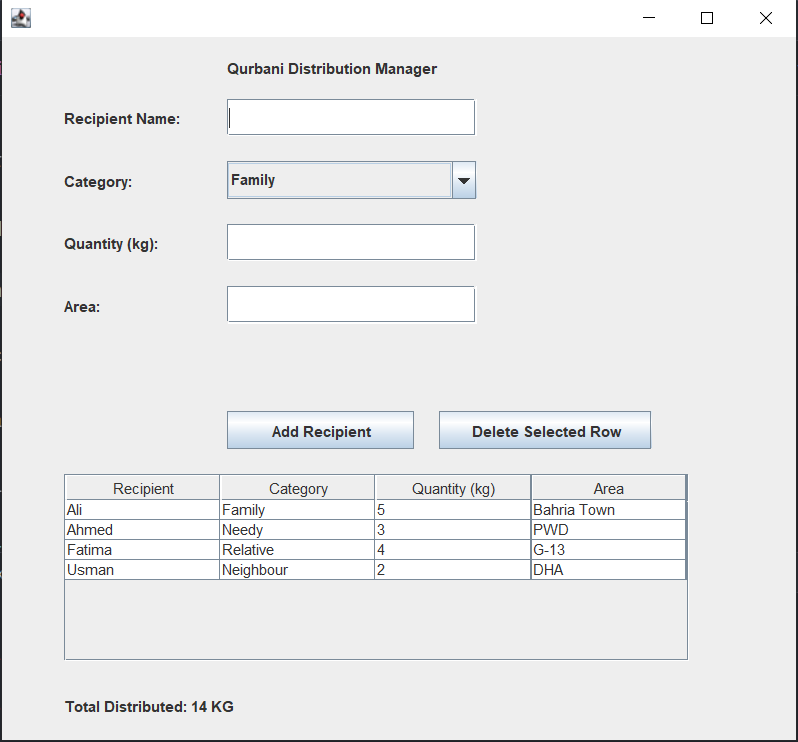
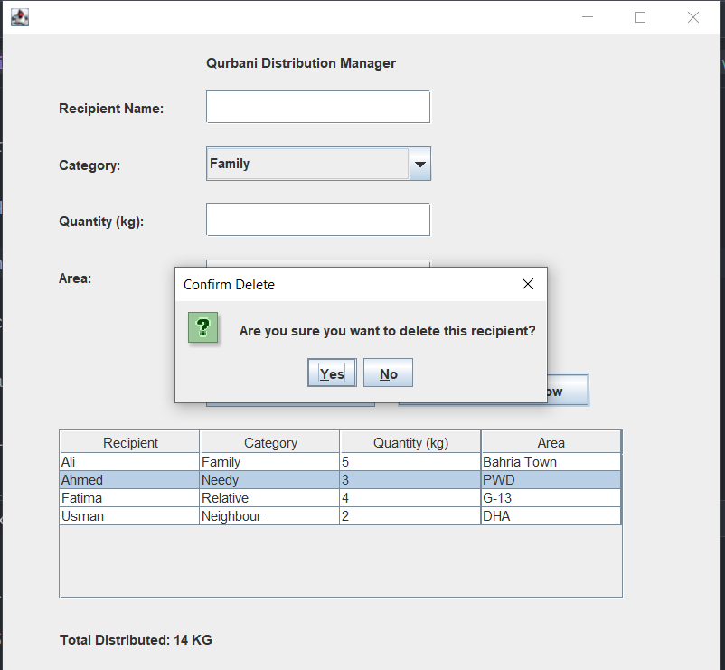
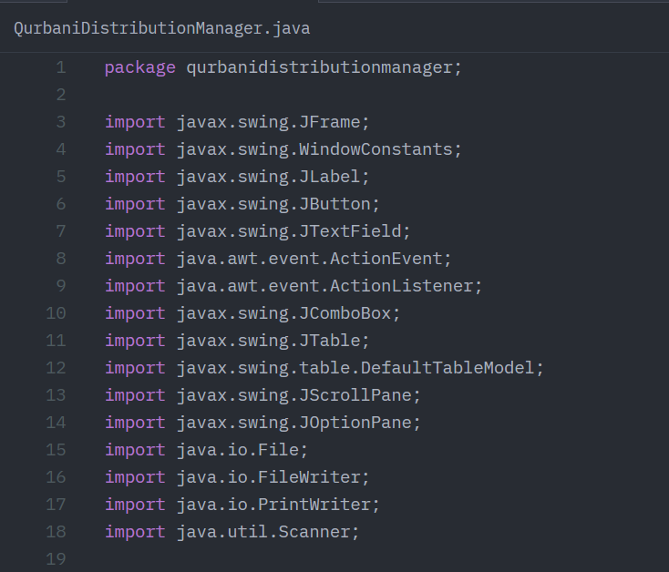
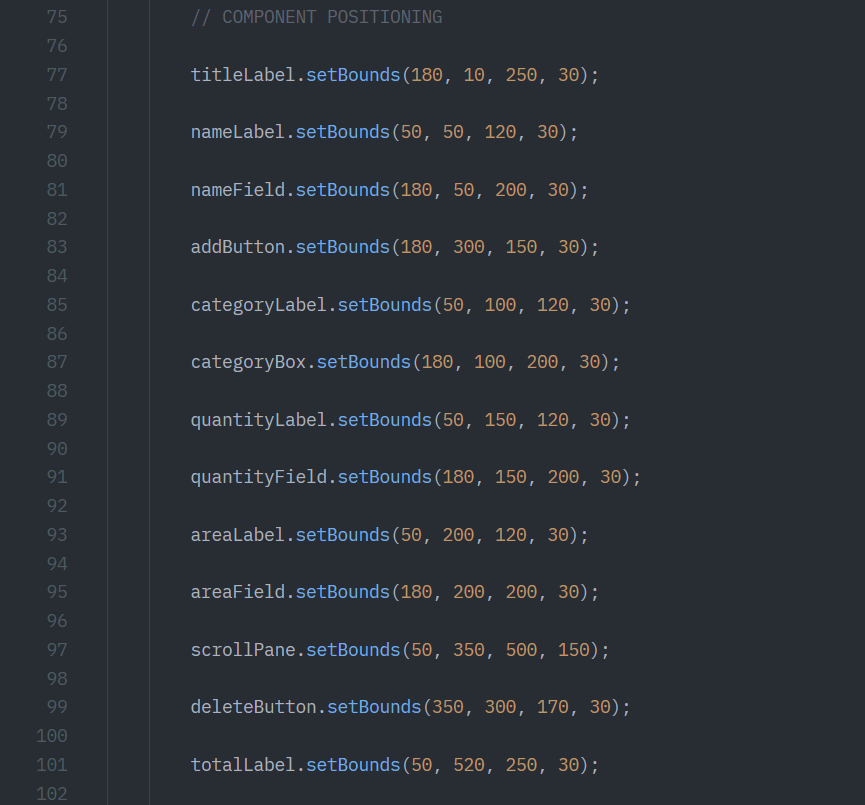
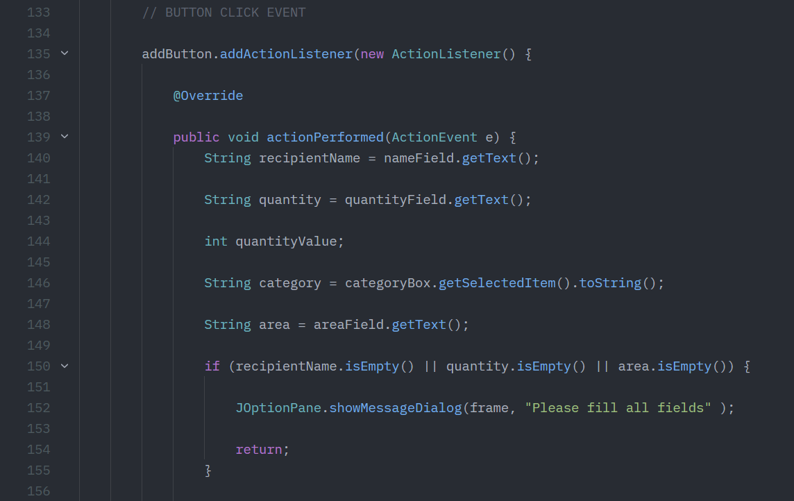
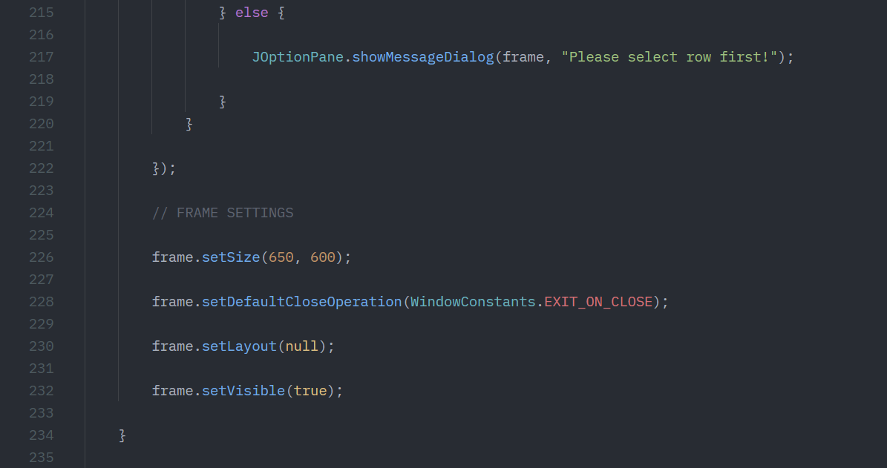
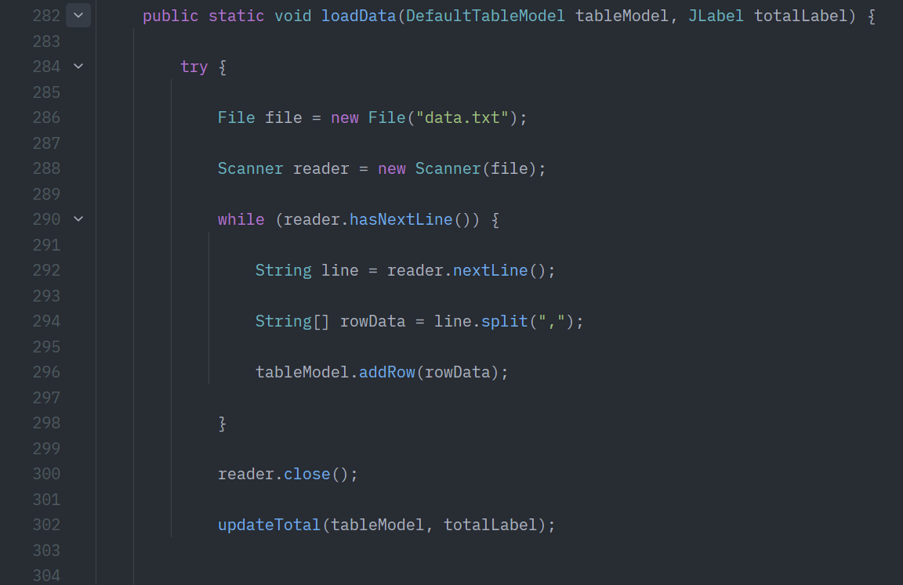

# 🐄 Qurbani Distribution Manager

A desktop-based **Java Swing** application developed to manage and track the distribution of Qurbani meat among recipients.

The application provides an intuitive graphical interface for recording recipient information, categorizing distributions, calculating the total quantity distributed, and storing data persistently using Java file handling.

This project was built to strengthen my understanding of **Java Swing, event-driven programming, JTable, file handling, data validation, and desktop application development.**

---

# ⭐ Features

* Add new recipients with distribution details
* Categorize recipients into predefined groups:

  * Family
  * Relative
  * Neighbour
  * Needy
* Record distributed quantity (kg)
* Store recipient area information
* Display all records in a JTable
* Delete selected records with a confirmation dialog
* Automatically calculate the total quantity distributed
* Persist records using a text file
* Load previously saved records on application startup
* Validate empty fields and numeric quantity input

---

# 🛠️ Technologies Used

* Java
* Java Swing
* JTable
* DefaultTableModel
* File Handling
* Event Handling

---

# 📁 Project Structure

```text
QurbaniDistributionManager
│
├── src
│   └── qurbanidistributionmanager
│       └── QurbaniDistributionManager.java
│
├── screenshots
│   ├── output
│   │   ├── 1.PNG
│   │   └── 2.PNG
│   │
│   └── code_snippets
│       ├── 1.PNG
│       ├── 2.PNG
│       ├── ...
│       └── 15.PNG
│
├── data.txt
├── build.xml
├── manifest.mf
├── README.md
│
├── nbproject
└── test
```

---

# 📸 Application Screenshots

## Main Application Window



The main interface allows users to:

* Enter recipient information
* Select a recipient category
* Record the distributed quantity
* Specify the recipient's area
* View all records in a JTable
* Monitor the total distributed quantity

---

## Delete Confirmation Dialog



To prevent accidental deletions, the application displays a confirmation dialog before permanently removing a selected record.

---

# 💻 Code Walkthrough

## Application Setup and Imports



Imports the Swing, AWT event handling, file handling, and utility classes required throughout the application.

---

## User Interface Components



The graphical interface is built using:

* JFrame
* JLabel
* JTextField
* JComboBox
* JTable
* JScrollPane
* JButton

---

## Input Validation and Record Addition



Before adding a record, the application validates:

* Empty input fields
* Numeric quantity values

to ensure valid user input.

---

## Quantity Calculation Logic



The total distributed quantity is automatically recalculated whenever records are added or deleted.

---

## File Persistence



Recipient records are stored in a text file and automatically loaded whenever the application starts.

---

# ⚙️ Application Workflow

1. Enter recipient information.
2. Select a recipient category.
3. Enter the distributed quantity and area.
4. Click **Add Recipient** to validate and save the record.
5. View all records in the JTable.
6. Save records to `data.txt`.
7. Automatically load existing records when the application starts.
8. Delete records using the delete button with confirmation.
9. Automatically update the total distributed quantity.

---

# 💾 Data Storage

The application stores records in a simple comma-separated format inside **data.txt**.

Example:

```text
Ali,Family,5,Bahria Town
Ahmed,Needy,3,PWD
Fatima,Relative,4,G-13
Usman,Neighbour,2,DHA
```

This lightweight approach provides persistent storage without requiring a database.

---

# ▶️ How to Run

### Compile

```bash
javac src/qurbanidistributionmanager/QurbaniDistributionManager.java
```

### Run

```bash
java -cp src qurbanidistributionmanager.QurbaniDistributionManager
```

---

# 📚 Concepts Practiced

This project strengthened my understanding of:

* Java Swing GUI Development
* Event-Driven Programming
* JTable and DefaultTableModel
* Input Validation
* File Reading and Writing
* Exception Handling
* Data Persistence
* Java Desktop Application Development

---

# 🚀 Future Improvements

Potential enhancements include:

* Edit existing records
* Search functionality
* Sorting and filtering
* Export records to CSV
* Database integration using MySQL
* Improved user interface using layout managers
* Statistics and reporting dashboard

---

# 👨‍💻 Author

**Muhammad Abdullah**

BSCS Student at COMSATS University Islamabad

GitHub: https://github.com/abdullahcodes-dev
